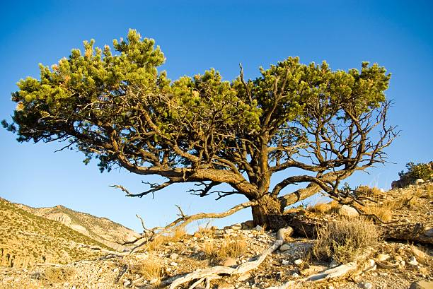
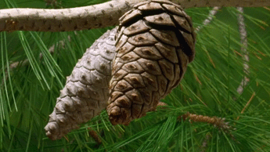
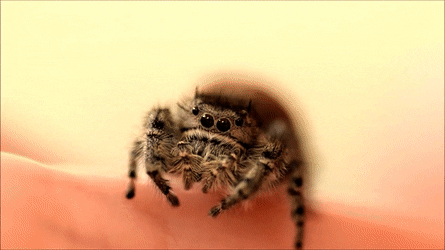

```{r setup, include=FALSE}
knitr::opts_chunk$set(echo = FALSE,warning=FALSE, message=FALSE)

library(tidyverse)
library(janitor)
library(easystats)
library(vegan)
library(leaflet)

#read and clean
dat<-dat<-read_csv("./data/YoungLivingPineProject.csv") %>%
  janitor::clean_names() %>% 
  select(-comments) %>% 
  select(-name) %>% 
  select(-cone_stage_14) %>% 
  select(-x15) %>% 
  select(-x1) %>% 
  select(-young_small_cones) %>% 
  select(-x18) %>% 
  select(-seed_number) %>% 
  remove_empty() %>% 
  pivot_longer(cols =all_of(c("conopthorus_sp_beetle_larva",
                                "megastigmus_wasp",
                                "midge",
                                "pinyon_bore_moth",
                                "spider",
                                "unknown_seed_insect")),
                 names_to = "insect_type",
                 values_to = "number_of_insect") %>% 
  add_column(long="long") %>% 
  add_column(lat="lat")

dat$long <- as.numeric(dat$long)
dat$lat <- as.numeric(dat$lat)

dat$date <-   paste0("01-",dat$month,"-2021") %>% as.POSIXct(format = '%d-%B-%Y')


dat<- dat %>%
  mutate(lat = case_when(tree_number == "2" ~ 40.1955,
                         tree_number == "3" ~ 40.1953,
                         tree_number == "4" ~ 40.1953,
                         tree_number == "5" ~ 40.1952,
                         tree_number == "6" ~ 40.1952,
                         tree_number == "7" ~ 40.1953,
                         tree_number == "8" ~ 40.1952,
                         tree_number == "9" ~ 40.1952,
                         tree_number == "10" ~ 40.1951,
                         tree_number == "11" ~ 40.1951,
                         tree_number == "12" ~ 40.1950,
                         tree_number == "13" ~ 40.1949,
                         tree_number == "14" ~ 40.1949,
                         tree_number == "15" ~ 40.1948,
                         tree_number == "16" ~ 40.1949,
                         tree_number == "17" ~ 40.1953,
                         tree_number == "18" ~ 40.1954,
                         tree_number == "19" ~ 40.1953,
                         tree_number == "20" ~ 40.1953,
                         tree_number == "21" ~ 40.1954,
                         TRUE ~ lat),
         long = case_when(tree_number == "2" ~ -110.4232,
                          tree_number == "3" ~ -110.4232,
                          tree_number == "4" ~ -110.4234,
                          tree_number == "5" ~ -110.4234,
                          tree_number == "6" ~ -110.4234,
                          tree_number == "7" ~ -110.4236,
                          tree_number == "8" ~ -110.4236,
                          tree_number == "9" ~ -110.4237,
                          tree_number == "10" ~ -110.4238,
                          tree_number == "11" ~ -110.4237,
                          tree_number == "12" ~ -110.4241,
                          tree_number == "13" ~ -110.4241,
                          tree_number == "14" ~ -110.4241,
                          tree_number == "15" ~ -110.4241,
                          tree_number == "16" ~ -110.4242,
                          tree_number == "17" ~ -110.4241,
                          tree_number == "18" ~ -110.4232,
                          tree_number == "19" ~ -110.4231,
                          tree_number == "20" ~ -110.4232,
                          tree_number == "21" ~ -110.4231,
                          TRUE ~ long))
```

<br>

```{r,fig.align='center',fig.width=10, fig.height=10}

```

## Project Overview
Young Living, Dr. Rotter and UVU students are working together to study how the phytochemistry of pinyon pine pine cones change as the insect communities of those pine cones change. Unfortunately we are still waiting for the phytochemistry information to come back, but in the mean time we can make some observations of the insect communities in these cones.

<br>
```{r,fig.align='center',fig.width=10, fig.height=10}

```
<br>

## Brief Background
Cones were collected from 20 different pinyon pine trees through out a year. Each cone was ranked on a scale of one to three based on stage. A rating of one means to cone is young and closed, two means middle and open, three means old, dry and open. The scales were measured in mm. Then the cones were inspected for insects. The insects were broken down into 6 different groups, one being a "catch-all" other and the rest being different insect types: conophthorus beetle, megastigmus wasp, midge, pinyon bore moth, and spider.

<br>

```{r,fig.align='center',fig.width=5, fig.height=5}

```

<br>

## Scale Thickness and Insect Communities
In the end we didn't have enough information to draw a conclusion for the entire community, so here we look at each insect type individually.

```{r}
knitr::opts_chunk$set(echo = FALSE,warning=FALSE, message=FALSE)

##insect community v scale size
dat%>%
  ggplot(aes(x=scale_thickness_mm,y=number_of_insect, color=insect_type))+
  geom_smooth()

 ######NMDS stuff#####
 dat_mat <- 
   dat %>% 
   select_if(is.numeric)
 
 ##insect community v scale size
 dat %>%
   mutate(ID = paste(tree_number,month,cone_stage_3,sep="_")) %>% 
   
   dplyr::group_by(ID, insect_type) %>%
   dplyr::summarise(n = dplyr::n(), .groups = "drop") %>%
   dplyr::filter(n > 1L)
 
wide <-  
 dat %>% 
   mutate(ID = paste(tree_number,month,cone_stage_3,sep="_")) %>% 
   pivot_wider(names_from = insect_type,values_from = number_of_insect,id_cols = ID,values_fn = sum)


keepers <- 
wide %>% 
  select(-ID) %>% 
  rowSums() > 0
 
wide <- 
  wide[keepers,]

thickness <- 
dat %>% 
  mutate(ID = paste(tree_number,month,cone_stage_3,sep="_")) %>% 
  group_by(ID) %>% 
  summarize(mean_thickness = mean(scale_thickness_mm,na.rm=TRUE))

thickness <- thickness[keepers,] %>% pluck("mean_thickness")

dat_dist <- 
wide %>% 
  select(-ID) %>% 
  vegan::vegdist(na.rm = TRUE)

dat_dist[is.na(dat_dist)] <- 1

MDS <- 
metaMDS(dat_dist,distance = "jaccard",binary=TRUE)
dat$scale_thickness_mm


NMDS <- 
data.frame(scale_thickness = thickness,
           MDS1 = MDS$points[,1],
           MDS2 = MDS$points[,2])


NMDS %>% 
  ggplot(aes(x=MDS1,y=MDS2,color=thickness)) +
  geom_point()

newkeepers <- 
which(!is.na(thickness))


new_wide <- 
  wide[newkeepers,-1]

adonis2(wide[newkeepers,-1] ~ thickness[newkeepers])

```

## Cone Stage and Insect Communities

```{r}
dat %>% 
  ggplot(aes(x=number_of_insect,y=cone_stage_3))+
  geom_point()
```

## Insect Communities Over Time

```{r}
dat %>% 
  ggplot(aes(x=date,y=number_of_insect,color=insect_type))+
  facet_wrap(~tree_number)+
  geom_smooth()+
  theme(axis.text.x = element_text(angle = 90))
```  

## Insect Communities and Location

```{r}
icons <- awesomeIcons(
  icon = 'tree',
  iconColor = 'black',
  library = 'ion',
  markerColor = "green")


leaflet(options = leafletOptions(maxZoom=18)) %>% 
  addProviderTiles(provider='Esri.WorldImagery', group='Satellite') %>%
  addLayersControl(baseGroups='Satellite',
                   options=layersControlOptions(collapsed=FALSE)) %>%
  addScaleBar(position='topleft')%>% 
  addAwesomeMarkers(lng = dat$long, lat=dat$lat, icon=icons)
```